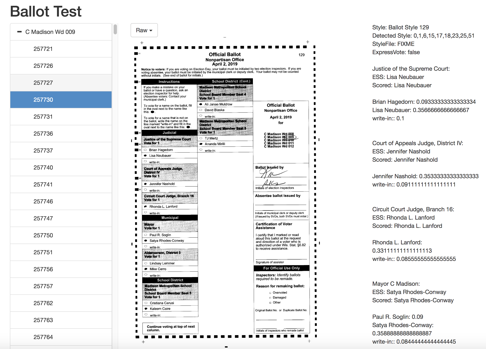
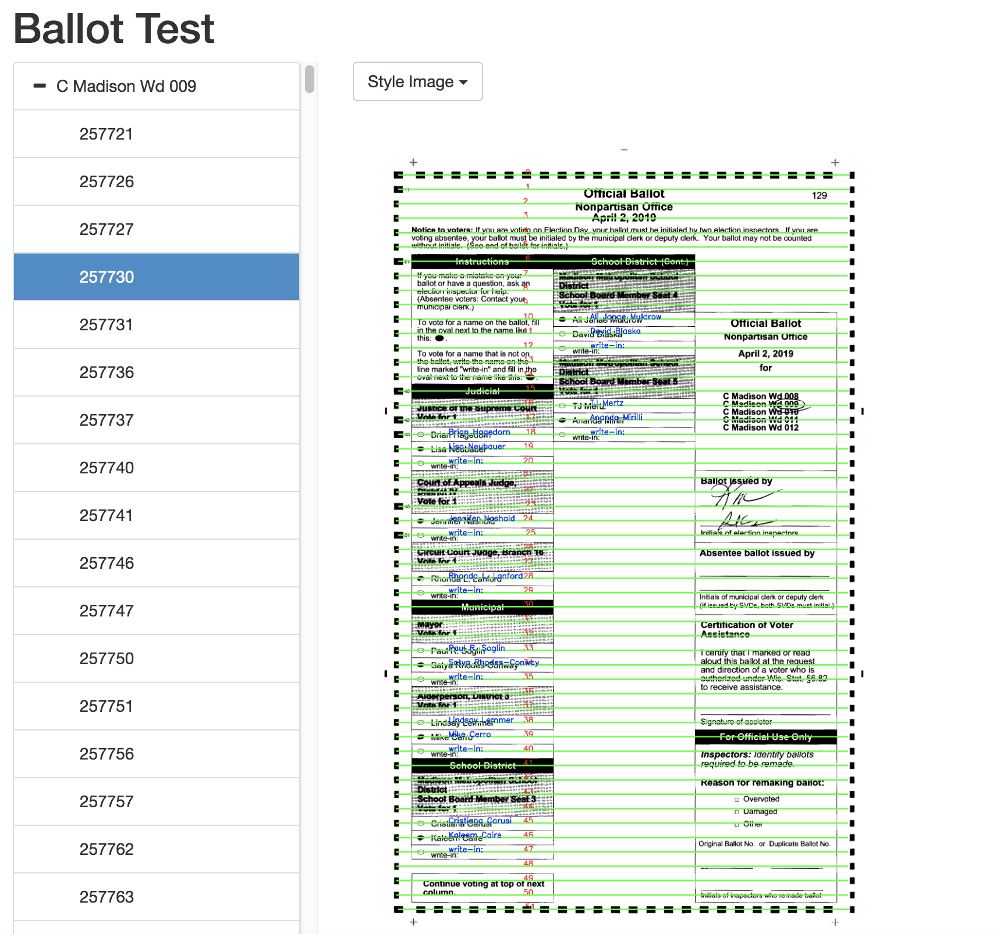
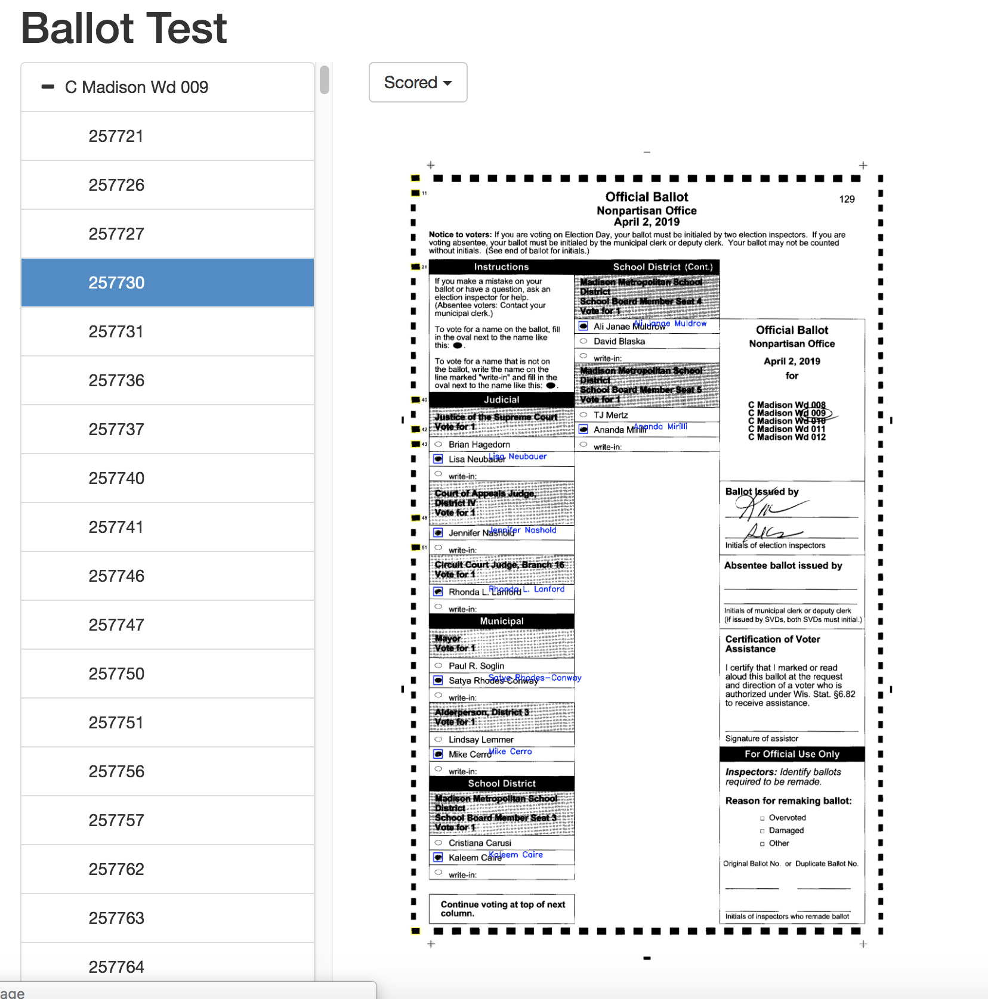
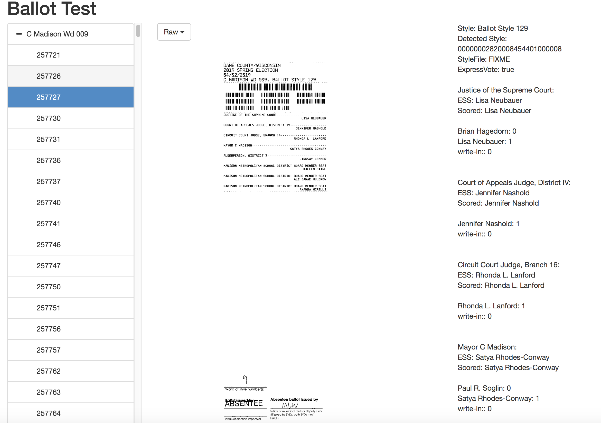

# PyBallotImage
Tools to use Optical Mark Recognition (OMR) to process ballot scans produced by ES&amp;S voting machines. Python 3 only. BSD licensed. 

## Warning
The code in this repo is a total mess, and the first few checkins will mostly be to just put things in one spot and get it into version control so it can be cleaned up, as well as installed in a fresh Linux VM so I can figure out exactly what are the true dependencies. This is all BSD licensed but you really probably want to wait a bit until I get this mess cleaned up.

## What is it

Voting systems from Election Systems and Software (ES&S) can provide voting districts with a set of scanned images of the ballots cast in an election, along with a spreadsheet of the "Cast Vote Record" (CVR) of each and every ballot, as determined by the ballot tabulator. Ballots have always been public records and open to inspection after the election by any interested party. In Dane County, Wisconsin, this dataset is now posted on the web after each election. Each ballot remains anonymous, just as it was when the vote was cast.

The code in the repository is meant to help interpret and process these images. This includes a python library to perform optical-mark recogintion on ballots, a tool to process the entire dataset, a tool to help construct the ballot style metadata, and a simple web application to visualize ballots. The tools process the hand-marked regular ballots, as well as decode the barcodes from ExpressVote Ballot-Marking Devices.

The eventual goal is to build a toolset to help election officials with "quality control" checks post-election. The tools will help identify ballots that may have been marked in unusual fashions that could have resulted in voter intent being missed, write-in ballots where the voter did not mark the write-in oval, ballots with visual artifacts that might indicate problems with the printing of the ballot or the scanner, such as banding or streaking in the scan or fold marks on the paper, especially when those artifacts might have come close to the contest option positions of the ballot, and to look for other issues on ballots such as marks near the timing tracks. And of course, the tools compare the CVR captured by ES&amp;S to the CVR the tools themselves decode, and flag disagreements between the two systems as ballot images to examine.   

It is important to state that an explicit non-goal of these tools is perform an election audit. It is at best a machine retabulation, and does not meet the standards set out by Lideman, Rivest, and Stark for an audit. For one, while the software to process the ballot images was developed independent of ES&amp;S, it still uses the same well-known computer vision techniques that ES&amp;S likely also uses in its software, and it is very likely that any ballot images that are challenging for one system to count are problematic for the other and both systems could miss the voter intent. More importantly, there is no direct link or identifier between the ballot images and the original paper ballot. If a problem is identified on an image, we cannot easily find the actual individual paper ballot that was the basis for the scan to verify the problem. These tools could be part of a machine-assisted audit, but the tools and the processes the produced the ballot images and tracked their chain of custody are not sufficient for a true audit that confirms an election outcome.  

## Core Functionality
The tools are built primarily using OpenCV, an open source computer vision package. The main class is BallotImage, which takes a PNG input, detects the "timing track" of black boxes on the border of a ballot, de-warps the image if it was scanned in at an angle so that it is all at a corrected 90-degree alignment, and then uses a ballot style metadata file along with the timing track to find the row and column of each choice on the ballot, and determines if a voter marked that choice. 
## Example Images

### Raw, unprocessed image 

### Ballot style metadata overlaid

### Ballot tabulated and voter's contest selections detected

### ExpressVote image



__Requirements (FIXME)__
Convert this into a requirements.txt

The non-python tools that are required are poppler, to extrac the PNG data from the PDFs Dane County publishes, and zbar for decoding barcodes.

Python libraries required:
numpy
opencv
pandas
pyzbar
flask
tqdm
flask_bootstrap
imutils by Adrian Rosenbrock of PyImageSearch
xlrd

I grabbed zbar from Homebrew but it conflicted with some of the graphics libraries from Anaconda, so I copied libzbar.dylib to a separate directory and overrode the search path:

```export DYLD_LIBRARY_PATH=/Users/epaulson/development/DaneCountyVotes/web/libs```

The web frontend uses Jquery, Bootstrap, [bootstrap-treeview](https://github.com/jonmiles/bootstrap-treeview) and [lightbox](http://lokeshdhakar.com/projects/lightbox2/) 

## Tools and Getting Started
There are four main tools to use, but before that, we'd better get some data.


### Downloading and converting images
First, download all of the images from the [Dane County Site](https://elections.countyofdane.com/Election-Auditing) and unzip them all to a common directory, I choose a directory named 'images':
```
total 0
drwxr-xr-x@    2 epaulson  staff      64 Apr 25 12:43 C Edgerton Wd 7
drwxr-xr-x@ 1742 epaulson  staff   55744 Apr 25 12:43 C Fitchburg Wds 1-4
drwxr-xr-x@ 2818 epaulson  staff   90176 Apr 25 12:53 C Fitchburg Wds 10-14
drwxr-xr-x@ 4314 epaulson  staff  138048 Apr 25 12:59 C Fitchburg Wds 15-20
drwxr-xr-x@ 4376 epaulson  staff  140032 Apr 25 12:45 C Fitchburg Wds 5-9
drwxr-xr-x@ 1238 epaulson  staff   39616 Apr 25 13:05 C Madison Wd 001
drwxr-xr-x@ 1070 epaulson  staff   34240 Apr 25 13:08 C Madison Wd 002
drwxr-xr-x@  878 epaulson  staff   28096 Apr 25 13:11 C Madison Wd 003
drwxr-xr-x@  696 epaulson  staff   22272 Apr 25 13:13 C Madison Wd 004
epaulson:~/development/DaneCountyVotes/April2019General/images $ ls -l C\ Madison\ Wd\ 003 |head -10
total 106496
-rw-r--r--@ 1 epaulson  staff    2150 Apr 25 13:11 Nonpartisan\261209c.pdf
-rw-r--r--@ 1 epaulson  staff  138971 Apr 25 13:11 Nonpartisan\261209i.pdf
-rw-r--r--@ 1 epaulson  staff    2081 Apr 25 13:11 Nonpartisan\261210c.pdf
-rw-r--r--@ 1 epaulson  staff  105914 Apr 25 13:11 Nonpartisan\261210i.pdf
-rw-r--r--@ 1 epaulson  staff    2109 Apr 25 13:11 Nonpartisan\261211c.pdf
-rw-r--r--@ 1 epaulson  staff  139081 Apr 25 13:11 Nonpartisan\261211i.pdf
-rw-r--r--@ 1 epaulson  staff    2142 Apr 25 13:11 Nonpartisan\261212c.pdf
-rw-r--r--@ 1 epaulson  staff  119790 Apr 25 13:11 Nonpartisan\261212i.pdf
-rw-r--r--@ 1 epaulson  staff    2149 Apr 25 13:11 Nonpartisan\261214c.pdf
```
Note that the directory is named for the ward in which the ballot images come from, we will use this name later.

While you're on the Dane County website, grab the Excel spreadsheets that have the Cast Vote Records for each ballot in structured form.

Now we need convert these from PDF into PNGs. The PDF files are literally only image holders so the conversion is straight-forward, the poppler package includes a tool called pdfimages that extracts the image embedded in the PDF (which is basically a fax) and spits out a PNG. There is a script called process.py that will convert all of the files it finds in one directory and create a matching directory structure elsewhere. 

```python process.py '/Users/epaulson/development/DaneCountyVotes/April2019General/images/C Madison Wd 003' /Users/epaulson/development/DaneCountyVotes/April2019General/pngs/```

Run that script on each of the subdirectories in 'images' to create a matching directory tree in 'pngs'. If you have a list of directories, you can use convert.sh to invoke the process.py script for you for each of the PDF directories in images/

### Import Cast Vote Records into a database
There is a simple a simple Python script that just reads the files into a Pandas DataFrame and dumps that to a SQLite database. **TODO**: add commandline options and make this useful, but for now, edit ```clerk_xls_to_sql.py``` with the names of the spreadsheet and then just run it. It writes data out a ```records.db``` SQLite database file. 


### Extract Ballot Styles and determine ExpressVote images
This tool, ```cmdline_check.py```, is meant to be the workhorse tool for most processing steps, but at the moment it's broken and only does one step (I broke everything when adding support for multiple processors and haven't added the other steps). Eventually, it will:

* Extract timing track and barcode info from each ballot (works now)
* Compute a Cast Vote Record for a set of ballots, given a Ballot Style definition file (a JSON file listing the rows and columns for a ballot type) and flag where it differs from what ES&amp;S tabulated.
* Search for a variety of known image artifacts (streaking, fold lines, ballots with incorrect number of boxes of in the timing track, etc)
* Send ExpressVote images to the Google Cloud Vision API to extract the text area of ballots

cmdline_check.py takes a slug of commandline options. The important ones are how to specify the input data to process. You can specify multiple inputdirs and every png ending with -000 will be used as a ballot image. The subdirectory name itself will be used as the Precinct. 

```python cmdline_check.py --basic --basic_output_file detected_wd9.csv --inputdir ../April2019General/pngs/C\ Madison\ Wd\ 009/ --nproc 4 --dbfile records.db ```

Alternatively, you can specify the exact CVR records that you wish to process. In this case, the tool will use the SQLite database to look up the Precinct of that CVR in order to find the appropriate subdirectory.

```
python cmdline_check.py --basic --basic_output_file only_2_files.csv --pngdir ../April2019General/pngs/ --cvrids 258152 258153 --dbfile records.db 
Items are 2
Chunk 0: starts at 0 ends at 2
100%|███████████████████████████████████████████████████████████████████████████████████████████████████████████| 2/2 [00:01<00:00,  1.94it/s]
[Basic] Elapsed: 1.0401771068572998
(opencvpy35) epaulson:~/development/DaneCountyVotes/PyBallotImage $ cat only_2_files.csv 
cvr_id,failed,style_string,express_vote,long_style_string,barcodes_string,boxcount
258152,False,"0,1,6,15,17,18,23,25,51",False,,,156
258153,False,"0,1,6,15,17,18,23,25,51",False,,,156
```
Now, we need to load that data into the SQLite database so we have a complete picture of the dataset - the CVR that ESS produced as well as our detected styles. This isn't automated yet so just run ```sqlite3 records.db``` and type in the following SQL:
Join that data into the SQLite database

```sql
.mode csv
.import detected_wd9.csv temptable
create table full as select * from results join temptable on results."Cast Vote Record"=temptable.cvr_id;
```

### Create Ballot Style Definition files
Dane County does not (yet) publish a Ballot Details Listing report from ElectionWare, which means that the metadata about which races are on which ballots and which row and column each contest option appears is not included in the dataset published on the web, so we have to reconstruct that ourselves. An example file is in this repo [Ballot Style 129](test_styles/Ballot_Style_129_style.json) but we will need them for all of the styles, of which there are 191 from the Dane County April 2019 general election. 

We get a little bit of help, however, from the ExpressVote ballots. ExpressVote barcodes encode not the names of the selections but the Row,Column pairs that would be marked if this was a hand-marked ballot. (See the ESS Blog Post about this for more details - [How are Ballots Read?](https://www.essvote.com/blog/our-technology/how-are-ballots-read/) )

Because we know from the CVR spreadsheet which choices are marked on each ExpressVote ballot, and we can find from each ExpressVote ballot a set of valid Row/Column combinations, we can by process of elimination work out which positions match to which choice. For example, we can take a ballot that voted for Tony Evers for Governor. We know that one of the row/column combos on that ballot are the position for Tony Evers but we're not sure which one, because this ballot has choices for multiple races. We can then take all other ballots that didn't vote for Tony Evers for Governor, and the union of every row/column combo on all of those ballots for every race, and call them the NotTonyEvers ballots. We know that because you can only vote for one candidate for Governor, of every choice in this NotTonyEvers set, none of them could possibly be for Evers, so for all fo the row/column combos on our Tony Evers ballot, we remove every combo that is in the NotTonyEvers set. (We're counting on some crossover voters here - we only need one voter to cross over!) If we're lucky, we should have only one combo left, which must be the position for Tony Evers. 

This algortihm mostly works, but we run into some trouble. For one, not every ballot style had a voter use the ExpressVote machine, so for those stlyes we can't do anything. In other cases, not enough voters used the ExpressVote machines so we don't get enough voters who crossed over or wrote in a candidate on every contest, but in those cases we at least output which choices are possible. 

This is all implemented in ```create_mappings.py```, but given the above limitiations, plus the reality that we can get this data from future Ballot Detail Listing Report from ElectionWare, we may not continue developing this tool.

### Web Visualization Tool

This is a basic Flask app to serve up ballot images, along with a simple jQuery powered web app to navigate through the images. As seen above, it can show the raw image, or an image where the ballot style has been overlaid (meant for manually insepecting the results from the ```create_mappings.py``` tool and to correct anything that it got incomplete), and to show an image where PyBallotImage tabulated a result (and compare it against the ESS-tabulated result, as recorded in the CVR spreadsheet.) It also exposes some of the debugging steps as the ballot is processed with OpenCV.

To run it, fire up:

```python webdemo.py --basic --inputdir ../April2019General/pngs/C\ Madison\ Wd\ 009/ --pngdir ../April2019General/pngs --dbfile records.db --styledir test_styles/```

and then visit [http://localhost:5000](http://localhost:5000) in your web browser.

Like cmdline_check, you can specify a directory of images to process (and you can specify multiple --inputdir choices) or you can list multiple --cvrids directly on the commandline, or you can give it a --cvrfile which is just a file of CVR IDs, one number per line. The CVRFile option is useful for when you compute a set of ballots with cmdline_check.py that disagree with what ES&amp;S tabulated, for example

Currently it always consults the SQLite database to determine the ballot style for the file, but in the future it will support detecting the ballot style direct from the timing track or Master Barcode of an ExpressVote and use that as the decoded style to do scoring/tabulation without needing any input data from ESS-computed results.

## TODO
A running list of todo items

* Create a requirements.txt file to make installation easier
* Add to PyPI
* Reorganize repo
* Replace all of the print() calls with calls to log()
* Re-enable cmdline_check to batch tabulate images and flag ballots that either can't be scored or score different than what ESS tabulated
* Re-add OpenCV checks to cmdline_check to look for visual artifacts. Items to check for include streaking, fold lines, and incomplete timing tracks
* Automatically import ESS barcodes and detected timing track information
* Add checks for unmarked write-in votes. ESS can check for this too, but it's not enabled in Dane County right now.
* Check for ballots where a voter mark is near but not in an oval. This is usually counted as an undervote. 
* Support a mode where we "re-run" the election, turning up and down the sensitivty to how many pixels need to be darkened for a ballot to count, both in and near an oval, and compare those results against the ESS calculated CVRs, etc
* Extract the text from the body of the ExpressVote ballots and send it to the Google Cloud Vision API, create a tool for fuzzy string matching to compare the text against the expected results from the CVR. Slightly complicated by the poor results of the Google Cloud OCR APIs in our initial experiments. Probably should slice out by line for better results
* Rework the timing track detection code to better fit to lines, should be more robust
* Rethink how to handle the SQLite database for operations. Eliminate passing connections around.
* Better tooling for CVRs/"Ballot Image Log"?
* Redo the frontend with React?
* Create a mobile app that uses the barcodes to verify the chocies on a ballot for early voters
* Package up in Docker to make it easier to stand up a site?
* Use [S3 Batch](https://aws.amazon.com/blogs/aws/new-amazon-s3-batch-operations/) to replace/augment cmdline_check?
* Store all output from cmdline_check as precomputed images?


 

